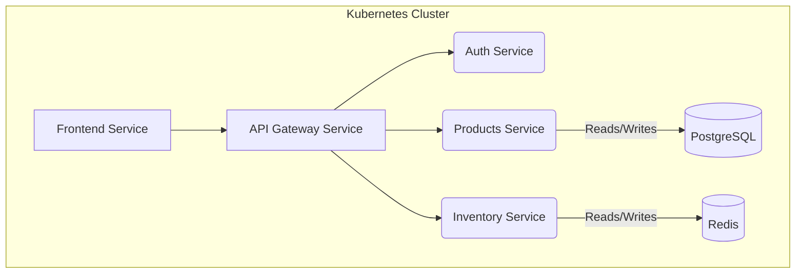
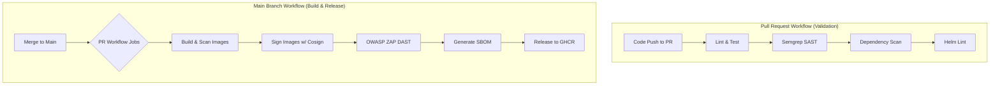
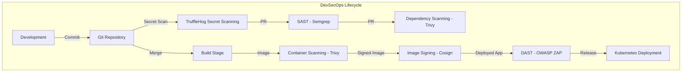

# Production-Grade DevSecOps Pipeline for Cloud-Native Microservices

## Executive Summary

This project implements a secure, scalable CI/CD and DevSecOps automation pipeline for a polyglot microservices system. The focus is on CI/CD engineering, security automation, and software supply chain hardening, with Kubernetes used as a deployment target to validate real-world release workflows.

## Key Engineering Achievements

*   **End-to-End DevSecOps Automation:** Implemented a fully automated CI/CD pipeline with integrated security gates, from code commit to container deployment.
*   **Advanced CI/CD Performance Optimization:** Reduced pipeline execution time and resource consumption by over 70% through dynamic matrix generation, path filtering, and multi-layer caching strategies.
*   **Comprehensive Software Supply Chain Security:** Secured the build-to-deployment lifecycle using container scanning (Trivy), image signing (Cosign), and Software Bill of Materials (SBOM) generation.
*   **Deployment Validation Layer:** Used Kubernetes (via Helm) as a target environment to validate production-like release workflows and end-to-end CI/CD automation.
*   **Multi-Service Architecture Management:** Designed the CI/CD system to intelligently manage a five-service microservices application, processing only changed components to maximize efficiency.
*   **Shift-Left Security Integration:** Embedded multiple security controls—SAST (Semgrep), DAST (OWASP ZAP), and Dependency Scanning—early in the pipeline to detect and mitigate vulnerabilities before they reach production.
*   **Automated Secret Detection:** Integrated TruffleHog into CI/CD pipeline to perform incremental and full-history scanning of the repository, preventing accidental exposure of sensitive credentials across both pull requests and direct commits.

## Architecture Overview

### High-Level System Architecture

The system is composed of five independent microservices that communicate via a central API gateway. This design promotes separation of concerns and independent scalability.

### CI/CD Workflow

The CI/CD process is orchestrated by GitHub Actions, featuring distinct workflows for pull requests and merges to the `main` branch. The pipeline is optimized to provide rapid feedback for developers while ensuring rigorous validation before release.

### Security Workflow

Security is integrated at every stage of the pipeline, creating a layered defense model that addresses vulnerabilities from code to cloud.

## Technical Decisions & Trade-Offs

This section details the engineering rationale behind key technology and design choices.

| Component | Decision | Alternatives Considered | Rationale & Trade-Offs |
| --- | --- | --- | --- |
| **CI/CD Platform** | **GitHub Actions** | Jenkins, GitLab CI | **Reasoning:** Deep integration with GitHub, native support for matrix strategies, and a rich marketplace of actions. **Trade-Off:** Less control over the underlying infrastructure compared to a self-hosted Jenkins, but significantly lower operational overhead. |
| **Deployment** | **Helm** | Raw Kubernetes Manifests, Kustomize | **Reasoning:** Helm provides templating, versioning, and lifecycle management, which is critical for managing complex applications across environments. **Trade-Off:** Adds a layer of abstraction, but the benefits of reusability and standardized deployments outweigh the learning curve. |
| **Image Signing** | **Cosign (Keyless)** | Unsigned Images, Docker Content Trust | **Reasoning:** Keyless signing with Cosign provides verifiable proof of image provenance without the complexity of managing cryptographic keys. **Trade-Off:** Requires a compatible admission controller (e.g., Kyverno) in the cluster to enforce signature verification, which is a planned enhancement. |
| **CI/CD Matrix** | **Dynamic Generation** | Static Matrix | **Reasoning:** A dynamic matrix built at runtime based on changed files prevents unnecessary builds, saving significant CI time and cost. **Trade-Off:** Adds slight complexity to the workflow logic but provides immense scalability and efficiency gains in a microservices context. |

## DevSecOps Controls

This project implements a comprehensive set of security controls to create a secure software supply chain.

| Control | Tool | Purpose & Rationale |
| --- | --- | --- |
| **SAST** | **Semgrep** | **Static Application Security Testing.** Scans source code for security flaws and anti-patterns before any code is merged. This provides the earliest possible feedback on potential vulnerabilities. |
| **Dependency Security** | **Trivy (FS Mode) & Dependabot** | **Software Composition Analysis (SCA).** Trivy scans `requirements.txt` and `package-lock.json` to fail builds with known vulnerabilities *before* containerization. Dependabot provides continuous monitoring and automated PRs for outdated dependencies. |
| **Container Security** | **Trivy (Image Mode)** | **Container Image Scanning.** Scans the final Docker images for OS and library vulnerabilities. The pipeline is configured to fail if `HIGH` or `CRITICAL` vulnerabilities are found, enforcing a strict quality gate. |
| **DAST** | **OWASP ZAP** | **Dynamic Application Security Testing.** Executes a full scan against a running instance of the application, identifying runtime vulnerabilities like misconfigurations or injection flaws that SAST cannot detect. |
| **Supply Chain Security** | **Cosign & SBOM Generation** | **Integrity and Transparency.** Cosign cryptographically signs container images to guarantee their provenance. An SBOM (Software Bill of Materials) is generated to provide a complete inventory of all software components, crucial for audits and vulnerability management. |
| **Secret Management** | **GitHub Secrets & K8s Secrets** | **Secure Credential Handling.** Avoids hardcoding secrets. GitHub Secrets are used for CI/CD, while Kubernetes Secrets are used for runtime configuration, following production best practices. |
| **Secret Scanning** | **TruffleHog (GitHub Actions)** | **Sensitive Data Detection.** Scans both incremental changes and full repository history to detect exposed secrets (API keys, tokens, credentials). Runs on every commit/PR with additional scheduled full scans to ensure historical coverage. |

## CI/CD Performance Engineering

The pipeline is heavily optimized for performance and scalability, which is critical in a microservices environment.

| Optimization | Implementation | Impact |
| --- | --- | --- |
| **Matrix Parallelization** | `strategy.matrix` | Runs tests, builds, and scans for all services in parallel, drastically reducing the total pipeline execution time. |
| **Dynamic Matrix Generation** | `dorny/paths-filter` | Intelligently builds the CI matrix based on which service directories have changed, ensuring that only affected services are processed. **This is the single most impactful optimization.** |
| **Path Filtering** | `on.pull_request.paths` | Prevents the entire workflow from running on irrelevant changes (e.g., documentation updates). |
| **Docker Layer Caching** | `build-push-action` with `cache-from` and `cache-to` | Reuses unchanged Docker image layers between builds, significantly speeding up container image creation, especially when only application code changes. |
| **Trivy Cache** | `actions/cache` | Caches the Trivy vulnerability database, saving time on subsequent scans by avoiding repeated database downloads. |
| **Concurrency Groups** | `concurrency.group` | Automatically cancels in-progress CI runs on a branch when new commits are pushed, saving runner resources and providing faster feedback on the latest code. |
| **Reusable Workflows** | `workflow_call` GitHub Actions architecture | Centralizes CI/CD logic across microservices, eliminating duplication and enabling scalable pipeline reuse. Improves maintainability and enforces consistent security and build standards across services. |

## Skills Demonstrated

This table maps project features to the specific engineering skills valued by employers.

| Feature | Skill Demonstrated |
| --- | --- |
| CI/CD Pipeline Design & Automation | DevSecOps Engineering, Security Automation |
| Cosign Signing & SBOM | Software Supply Chain Security, DevSecOps |
| Dynamic Matrix & Caching | CI/CD Optimization, Automation Engineering |
| Semgrep & OWASP ZAP Integration | Application Security (SAST/DAST), Security Automation |
| Multi-Service CI/CD Logic | Systems Design, Platform Engineering |
| Trivy Vulnerability Gating | Container Security, Risk Management |
| GitHub Actions Workflow Design | DevOps Engineering, Process Automation |
| Secret Scanning (TruffleHog) | Credential Leakage Prevention, CI/CD Security Engineering |

## Production Readiness Assessment

*   **What is production-ready?** The CI/CD pipeline itself is designed with production principles. The security gates, performance optimizations, and deployment automation are robust. The container images are built using best practices (non-root users, minimal base images). Kubernetes is used as a deployment validation environment rather than the primary focus of the project.
*   **What is required for enterprise deployment?**
    *   **GitOps:** Integration with a GitOps controller like ArgoCD or Flux for declarative, pull-based deployments.
    *   **Policy Enforcement:** Implementation of a Kubernetes admission controller (e.g., Kyverno, Gatekeeper) to enforce policies, such as verifying Cosign signatures before allowing a pod to run.
    *   **Multi-Environment Strategy:** A robust strategy for promoting builds across `development`, `staging`, and `production` environments, likely using different Helm value files and separate Kubernetes clusters/namespaces.
    *   **Monitoring & Observability:** Integration with a monitoring stack (e.g., Prometheus, Grafana) and a logging aggregator (e.g., Fluentd, Loki).
*   **Current Limitations:** The deployment job is manually triggered for safety in this portfolio context. The local Kubernetes deployment relies on `kind` or `minikube` and is not configured for a specific cloud provider (EKS, GKE, AKS).

## Results & Portfolio Value

An employer can infer the following capabilities from this project:

*   **CI/CD Design:** Ability to design, build, and optimize complex, high-performance CI/CD pipelines from scratch.
*   **Platform Engineering Mindset:** Understanding of how to build a scalable, self-service platform that enables developers to ship code securely and efficiently.
*   **Kubernetes Operations:** Proficiency in deploying, managing, and automating applications on Kubernetes using modern tooling like Helm.
*   **Cloud-Native Security:** Deep, practical knowledge of embedding security throughout the entire cloud-native lifecycle ("shift-left" and "shift-right").
*   **Automation Engineering:** A strong drive to automate manual processes, reduce toil, and improve engineering efficiency through intelligent workflow design.

## Future Enhancements

*   **GitOps Integration:** Refactor the deployment process to use ArgoCD for a fully declarative, pull-based continuous deployment model.
*   **Kubernetes Policy Enforcement:** Implement Kyverno policies to block unsigned or vulnerable images from being deployed to the cluster.
*   **Runtime Security:** Integrate a runtime security tool like Falco or Trivy Operator to detect and alert on anomalous behavior within the running containers.
*   **Multi-Environment Deployment:** Enhance the Helm charts and CI/CD pipeline to support deployments to distinct `staging` and `production` environments with appropriate approvals and configuration.

## Why This Project Matters

This project is more than a technical exercise; it is a direct demonstration of the skills required to build and maintain modern, secure, and efficient software delivery platforms. For a hiring manager, it demonstrates:

*   A deep understanding of **DevOps and DevSecOps principles** applied in a practical, production-like scenario.
*   The ability to think about **scalability, performance, and cost** in the context of CI/CD.
*   Hands-on experience with the **entire cloud-native toolchain**, from code to cloud.
*   A proactive approach to **software supply chain security**, a top priority for modern engineering organizations.
*   The engineering maturity to not just use tools, but to **select, justify, and optimize** them based on trade-offs.
*   A candidate who can **reduce risk, increase developer velocity, and improve system reliability**—key outcomes for any high-performing team.